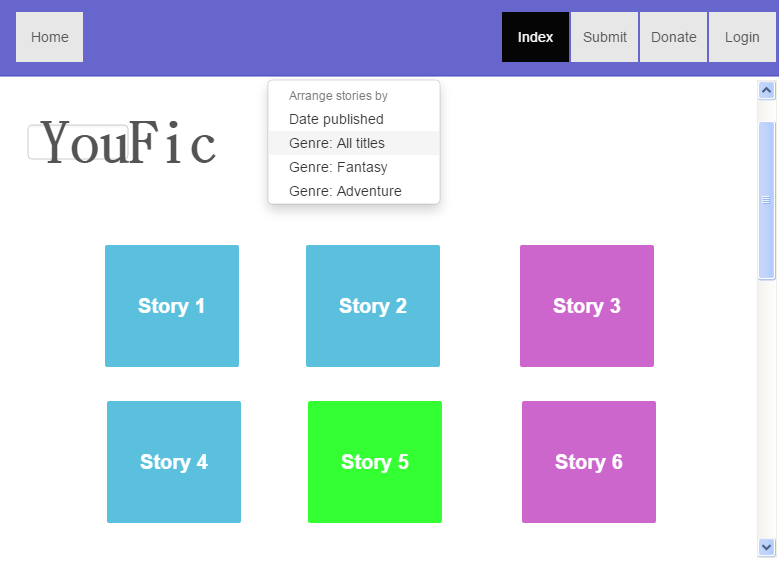
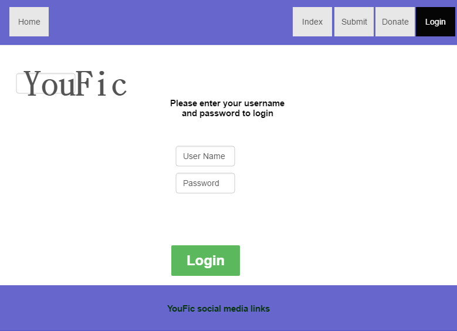
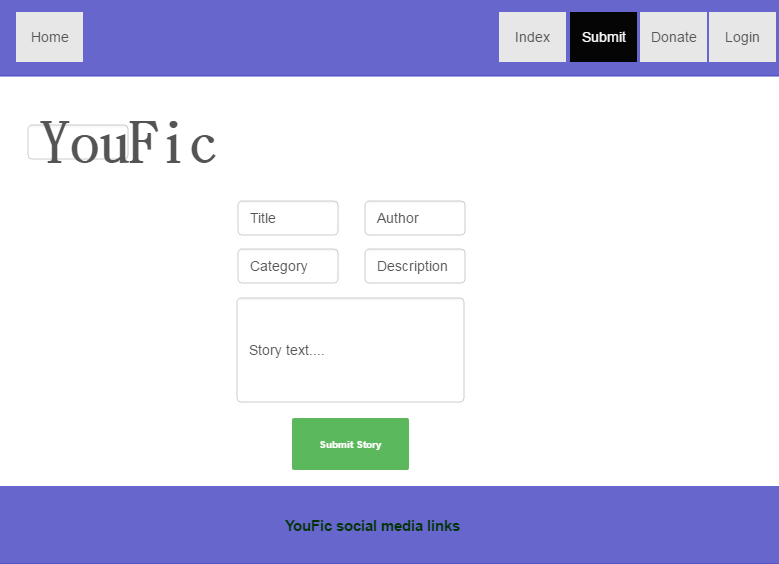
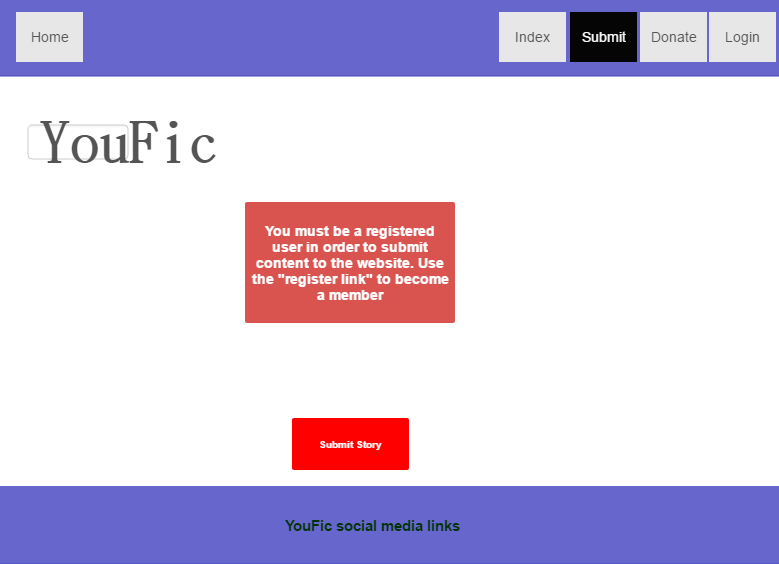
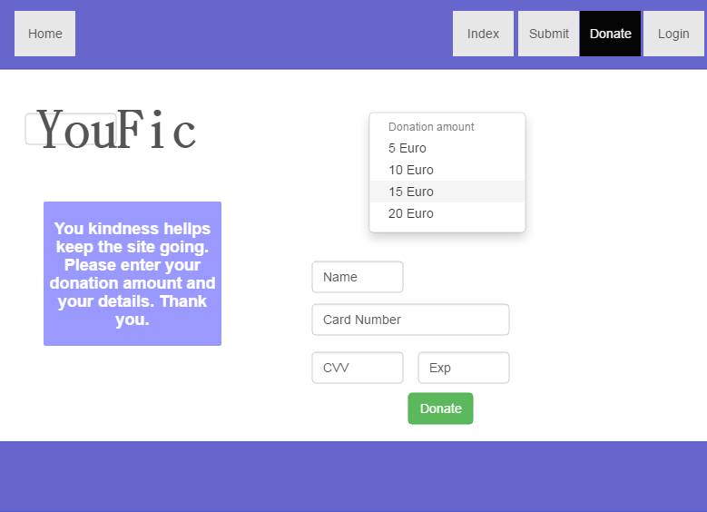
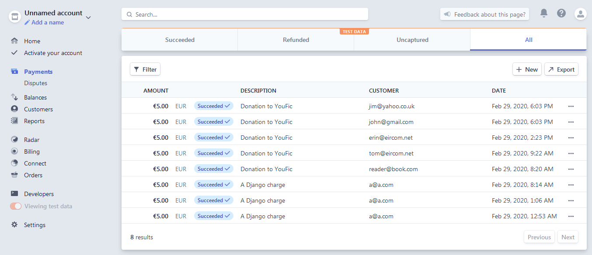
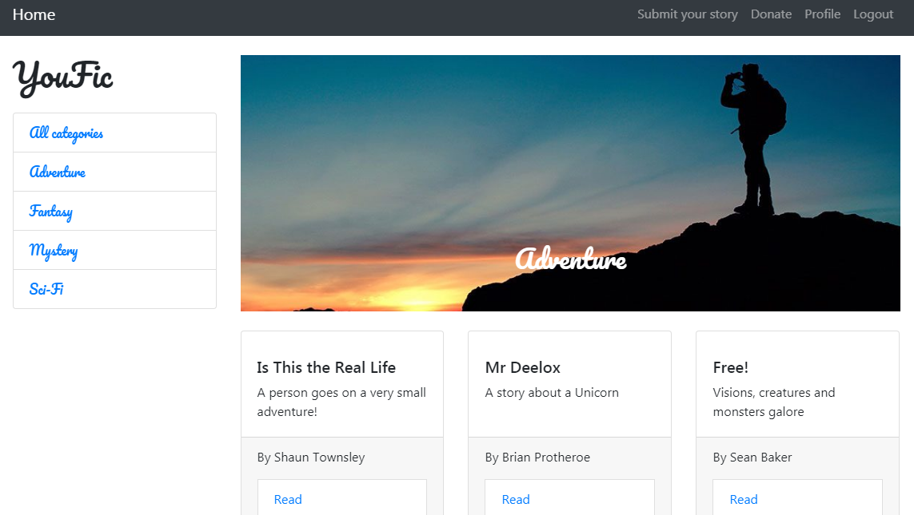
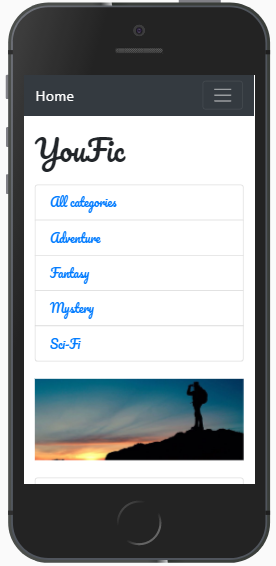

# YouFic #

----------

*Integration status*

----------

## About ##

YouFic, short for "You Fiction", is a website that facilitates the sharing of user created fiction stories. The name "YouFic" (short for You "Fiction") is a play on the title of the iconic website "YouTube". With YouTube, users can upload videos created by themselves for all to see. YouFic offers a similar service for people who want to share their fiction stories with the world.

## Website Goal ##

The goal of the website is to provide a central place where readers of fiction can access the latest user created stories. It also aims to be a place where aspiring writers could potentially get noticed by publishers.

The website is designed to be pleasant to use on both desktop and mobile devices. Good user experience on mobile devices is essential as many many people read whilst on the move on-board public transport etc. This dual functionality is achieved through the use of responsive design principles.

----------
----------

## UX ##

## User Stories ##

**User story 1:**

As a regular reader of fiction, I would like to browse the stories available and quickly select the one I am interested in. The short descriptions featured on the website for each story helped me select the stories I was interested in.

**User story 2:**

As a fan of science fiction, I would like to filter my browsing session to only display science fiction stories. I was able to use the websites category links to achieve this.

**User story 3:**

As an aspiring writer, I would like a service where I can quickly and easily publish my work and build a name for myself. After registering with the website, I was able to submit my stories for all to read.

**User story 4:**

As a fan of amateur fiction, I like that there is a resource for writers and fans to consume and create content. I was able to support the website by clicking on the donate link and helping pay for the upkeep of the website.

**Wireframes**

**Main index page wireframe**

Here we see the main layout to be used throughout the website. We have a navigation bar with buttons that will link the user to various sections of the site. We have a home button that can instantaneously bring the user back to the index page from anywhere on the website. We see a drop down list that the user can select a category of story to read. We see the story's laid out in a grid fashion. The use will be able to click on any of the stories in the grid and they will be taken to a page that displays that story.

*Image... Main index page*

**Login page wireframe**

Here we see a typical login dialogue. There is a password field and a username field along with instructions for the user. Note the social media links section in the footer.

*Image... login page*

**Submit a story page wireframe**

This is what the user should see should they be logged in and click the "submit a story" button. There are various fields for the user to fill out such as the title of the story as well as the users name that will be the author of the story. The user also should have the choice of four category's for their story. This category will be used to sort the story's on the main page.

*Image... submit a story page*

**Must register page wireframe**

Here we see what should happen should a user try to submit a story without being a member of the website. The user should be conveniently linked to the registration page should they see this message.

*Image... must register page*

**Donate page wireframe**

The user should be informed that their contribution is appreciated. There should also be minimal barriers in the way of a user making a payment. It should be simple and fast. Note the credit card details field as well as the security fields such as CVV and expiry date fields.

*Image... donate page*

## Features ##

- Responsive
- Browse as guest
- Browse as member (allowing upload of content)
- Make a donation to the running of the website
- Submit a story to the database
- Read the story's of other members
- Works well on both desktop and mobile devices

## Django Apps ##

There are three main apps developed for the website that could be potentially used again in other projects.

**Accounts**

A heavily modified version of the Accounts app developed based on tutorials by the Code Institute. As the app was developed for Django 1, the main modifications revolve around updating syntax to target Django 2.

**Donate**

Handles payment functionality. Makes use of checkout.js to render the payment form.

**Story**

Renders all of the story thumbnails, deals with sorting the story's into categories. Also displays individual story's for reading by the user.

## Models ##

**Story:**

title (CharField)
author (CharField)
description (TextField)
image (ImageField)
category (CharField, Adventure, Fantasy, Mystery, SciFi)
text (TextField)
published (DateTimeField)

## Technologies Used

**Accounts by Code Institute**

The website utilises a heavily modified version of the "Accounts" Django app created by Code Institute as part of the tutorial series "Authentication and Authorisation". 

[https://github.com/Code-Institute-Solutions/AuthenticationAndAuthorisation](https://github.com/Code-Institute-Solutions/AuthenticationAndAuthorisation)

**Stripe 'checkout.js'**

Checkout.js by Stripe encapsulated much of the payment functionality used to create the 'Donate' button. 

The following tutorial by William Vincent provided inspiration for payment integration on this website:

[https://testdriven.io/blog/django-stripe-tutorial/](https://testdriven.io/blog/django-stripe-tutorial/)

**Forms Bootstrap**

Many of the forms used throughout the website were styled and implemented using forms-bootstrap.

To install it, use 'pip3 install forms-bootstrap'

**Whitenoise**

Whitenoise middleware was used to provide a simple static file hosting solution on the production build of the website.

To install it, use 'pip3 install whitenoise'

**Django**

A Python based web framework

Version: 3.0.3

[https://www.djangoproject.com/](https://www.djangoproject.com/)

**Visual Studio Code**

A full featured IDE for use with many languages and frameworks

[https://code.visualstudio.com/](https://code.visualstudio.com/)

**Languages**

HTML5, Javascript, CSS, Python

**Paint.Net**

To retouch product photographs.

[https://www.getpaint.net/](https://www.getpaint.net/)

**Travis**

Continuous integration testing was carried out with the aid of Travis

[https://travis-ci.com/](https://travis-ci.com/)

**Stripe**

All payment functionality for this website is handled by the Stripe payment service.

[https://stripe.com/](https://stripe.com/)

**GitHub**

Version control was handled through the integrated Git features on VSCode. Code hosting was provided by GitHub.

[https://github.com/](https://github.com/)

**Pillow 7.0.0**

For image processing used version 7.0.0 of Pillow. Pillow is a Python imaging

Python Imaging Library (abbreviated as PIL) (in newer versions known as Pillow) is a free library for the Python programming language that adds support for opening, manipulating, and saving many different image file formats.

[https://pypi.org/project/Pillow/](https://pypi.org/project/Pillow/)

**Gunicorn**

Green Unicorn is a WSGI server used to host the production build.

[https://gunicorn.org/](https://gunicorn.org/)

**Shop Homepage theme**

The main layout of the site is acheived through the use of the Shop Homepage theme from Start Bootstrap.

[https://startbootstrap.com/templates/shop-homepage/](https://startbootstrap.com/templates/shop-homepage/)

**Chrome**

Main web browser used for development.

[https://www.google.com/chrome/](https://www.google.com/chrome/)

**Heroku**

The server of choice for hosting the production build.

[https://www.heroku.com](https://www.heroku.com)

**SQLite3**

Provided with Django, this simple database solution was used for development as well as initial production deployment. Note that it is not suitable for long term deployment.

[https://www.sqlite.org](https://www.sqlite.org)

**Pencil**

Prototyping program used to create the early wireframes.

[https://pencil.evolus.vn/](https://pencil.evolus.vn/)

## Testing

**Functional testing**

The following tests were conducted on the website to test its functionality.

Test 1. Index page - All category's

1. Visit the website
2. Click the link to the side labelled "All category's"
3. A list of all story's currently held in the database should be displayed

Test 2. Index page - Single category

1. Visit the website
2. Click the link to the side labelled "Fantasy"
3. A list of all story's currently held in the database belonging to the 'Fantasy' should be displayed 

Test 3. Home button

1. Visit the website
2. Click the link in the navigation bar for the 'Donate' page
3. The user should be brought to the Donate page
4. Now click the 'Home' button
5. The user should be redirected to the index page showing all story's currently in the database

Test 4. Donate page tests

1. Visit the donate page
2. Click the donate button
3. On the pop-up dialogue, enter and email address and an incorrect credit card number
4. Click the 'Make Payment' button
5. The pop up should give an error message relating to the incorrect credit card number
6. Now enter a working test credit card number (4242 4242 4242 4242).
7. Enter an expiry date for the year 2019.
8. Click the 'Make Payment' button
9. The pop up should give an error message relating to the incorrect expiry date
10. Now enter an expiry year of 2022.
11. Enter a CVV number of only two digits
12. Click the 'Make Payment' button
13. The pop up should give an error message relating to the incorrect CVV number
14. Enter a correct CVV number (of any three digits)
15. Click the 'Make Payment' button
16. The payment should be processed
17. The user should be redirected to a 'thank you' page

**Successful stripe payments**

Here we can see that the donate functionality is working. Stripe.com offers account holders a summary of all transactions on their account. Although the payments shown here are tests, if a real card were used, real money would be transferred.

*Image... Screenshot of Stripe.com showing successful payments.*

Test 5. Login / Register tests

1. Visit the website
2. If the user is logged in, click the logout button
3. The footer should display the message "Currently browsing as Guest"
4. Now click the 'Register' button
5. Enter a user name of 'TestUser' and and email address of 'testuser@gmail.com'
6. Leave the password field blank
7. Click the 'Register button'
8. The form should inform the user that a password must be entered
9. Enter a password in the password field as well as the confirmation field
10. The user should now be redirected to the index page and the footer should read 'Logged in as TestUser'
11. Click the logout button
12. The user should be redirected to the index page
13. The footer should again read "Currently browsing as Guest"

Test 6 Submit page tests

1. With the user logged out, click the 'submit a story' button
2. The user should be redirected to the 'submit' page
3. The user should be informed that only registered users can submit story's
4. Click the login button
5. The user should be redirected to the login page
6. Enter some valid details and login
7. Again click the 'submit a story' button
8. The user should be redirected to the 'submit' page only this time, there should be a number of fields for entering some story details
9. Fill out all of these fields with the exception of the field labeled 'title'
10. Click the 'Publish story' button
11. The user should be informed that the 'title' field needs to be filled in
12. Now enter a title and click the 'Publish story' button
13. The user should be directed to the index page
14. Click the category selector for the category of the story input in step 9
15. The story should no be available for reading

**Testing on various devices / emulators / browsers**

The site running on a desktop computer running Chrome:

*Image... Chrome browser rendering the website*

The site running on an android phone (emulated):

*Image... Samsung Galaxy rendering the website*

## Deployment

**Running the website locally**

Here are the steps required to run this website with the VSCode IDE

1. Download this GitHub repo and unzip
2. Open the unzipped folder in VSCode
3. Open a terminal
4. Type: 'python -m venv env' to create a virtual environment
5. Type: 'env\scripts\activate' to activate the virtual environment
6. Type: 'pip3 install django' to install Django 2
7. Type: 'python manage.py makemigrations' followed by
'python manage.py migrate' to create a database based on the models defined in the repository source code
8. Type: 'python manage.py runserver' to activate the inbuilt Django test server
9. Open a browser on the address 'localhost:8000'
10. You should now see the index page however there will be no story's currently in the database. These can be easily input by creating a user account and entering them from the 'submit' page
11. In order to access the admin functionality,go to the terminal
12. Type 'python manage.py createsuperuser'
13. Enter a name, email address and password
14. Now go to a browser and type the address 'localhost:8000/admin'
15. You can now log in and manipulate the database from Django's admin software

**Running the website on Heroku**

To deploy to Heroku, the following steps were taken.

1. Gunicorn was installed as the WSGI webserver.
2. Whitenoise was installed to handle static files.
3. Environment variables were taken out of the source code and put into a separate file.
4. An app was created on Heroku called 'youfic'
5. This app was linked to the YouFic GitHub repository.
6. The app was set to automatically deploy upon each GitHub commit.
7. Environment variables were added to the settings page on the Heroku app.
8. Media root and static root constants were set-up to reflect the static and media directory's of the project directory structure. This allowed the media files to be found by referencing the static root in code.

## Credits

- The Code Institute team
- Spencer Barriball
- Code Institute students on Slack
- @ckz8780 on Slack for fixing my MEDIA_ROOT issue

## Sources of information

**Django documentation v3.0:**

[https://docs.djangoproject.com/en/3.0/](https://docs.djangoproject.com/en/3.0/)

**Code Institute tutorials.**

[www.codeinstitute.net/](www.codeinstitute.net/)

**Start Bootstrap**

Theme templates.

[https://startbootstrap.com/](https://startbootstrap.com/)

### Media

All photographs used on the website were obtained from Google Images under free free use terms.

[https://www.google.com/advanced_image_search](https://www.google.com/advanced_image_search)

The example stories used on the website were obtained with permission from FanFiction.net

[https://www.fanfiction.net/](https://www.fanfiction.net/)